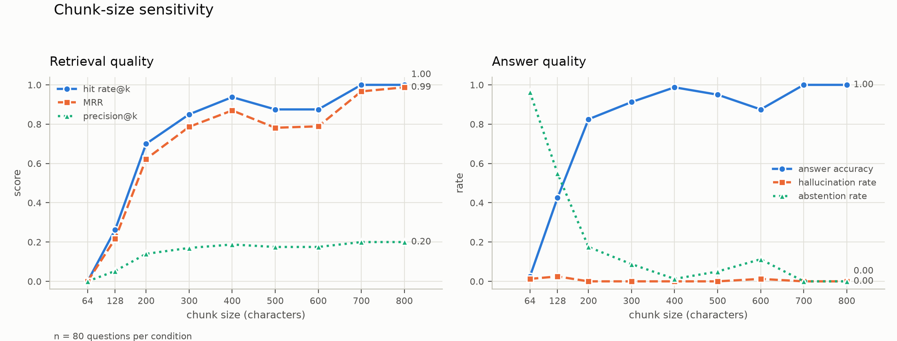
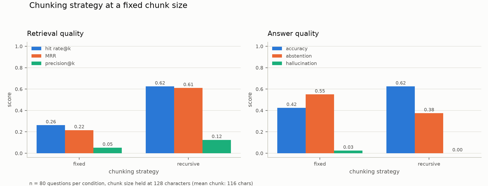
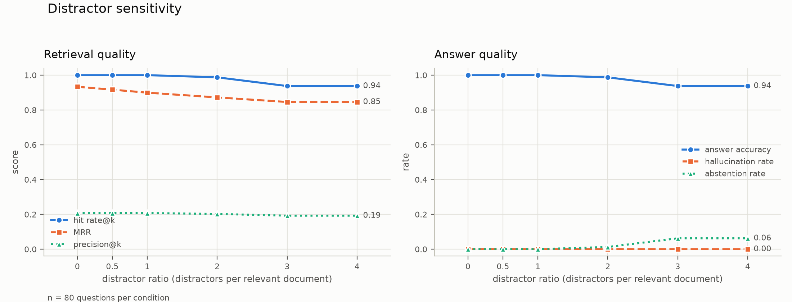
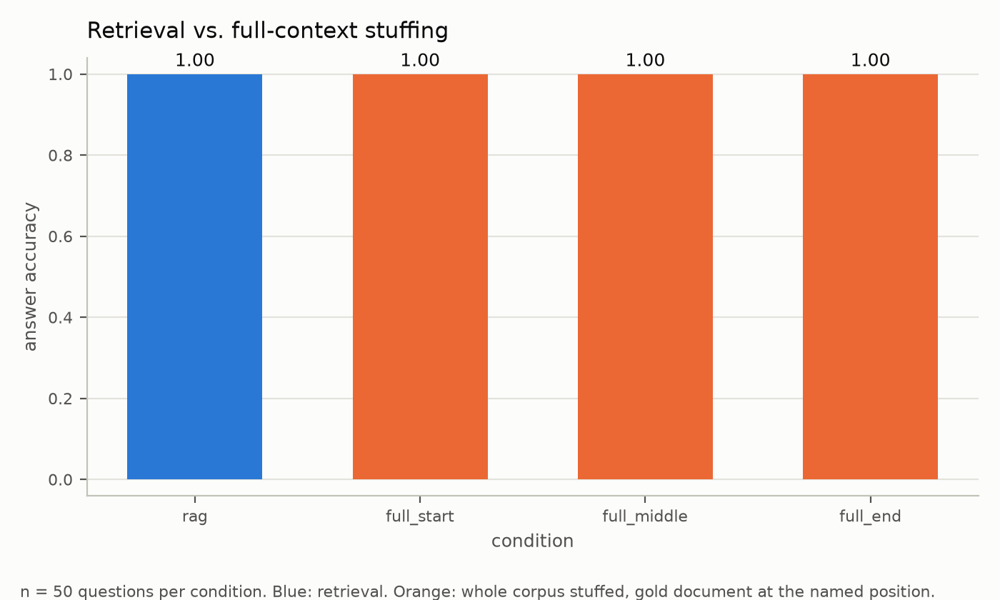

# Where Retrieval-Augmented Generation Breaks: Three Controlled Stress Tests

**Status: draft. All three experiments have been run and written up.** Every
number below comes from a run that actually happened; nothing is estimated.
Two of the three experiments produced negative or null results, and are
reported as such rather than reframed — see §4.1, §5.1, and Limitations 7–8.

---

## 1. Motivation

Retrieval-augmented generation is usually demonstrated rather than tested. A
typical demo shows a pipeline answering a question correctly and stops there,
which establishes that the technique can work but says nothing about when it
stops working, or which of its stages fails first.

That gap matters in practice, because a RAG pipeline has two failure points that
look identical from the outside. A wrong answer can mean the retriever never
surfaced the relevant passage, or it can mean the retriever surfaced it and the
generator ignored it. These call for opposite fixes — better chunking or
embeddings in the first case, better prompting or a different model in the
second — and a single end-to-end accuracy score cannot distinguish them.

This paper characterizes three known failure modes under controlled conditions,
measuring retrieval quality and answer quality as separate quantities
throughout:

1. **Chunk-size sensitivity.** How retrieval and answer quality vary with the
   chunk size and chunking strategy used at index time.
2. **Distractor sensitivity.** What happens as the corpus fills with documents
   that are topically and lexically similar to the answer-bearing one but
   contain no answer.
3. **Long-context vs. retrieved-context.** Whether stuffing an entire corpus
   into a long context window outperforms retrieval, and whether the position of
   the answer within that context affects whether the model finds it — the
   "lost in the middle" effect.

### 1.1 Relation to existing work

The three phenomena studied here are not novel discoveries; each has been
reported in the literature. The contribution of this work is a single controlled
harness that measures all three against one fixed corpus and one fixed question
set, with retrieval and answer quality separated, and with exact ground truth
rather than approximate string matching.

- **Lost in the middle.** Liu et al. (2023) showed that language models retrieve
  information most reliably from the start and end of a long context, with a
  measurable dip in the middle. Experiment 3 replicates this probe on a current
  model and contrasts it with retrieval on the same corpus.
- **Distractor sensitivity and retrieval noise.** Work on noisy retrieval (e.g.
  Cuconasu et al., 2024, on the role of irrelevant and distracting passages)
  reports that irrelevant context can degrade generation quality, and that
  *near-miss* distractors are more damaging than random ones. Experiment 2 uses
  distractors generated from the same templates as the gold documents, which is
  the near-miss case by construction.
- **Chunking.** Chunk size is widely treated as a tuning parameter in practice
  but is less often measured as an independent variable with retrieval and
  answer quality reported apart. Experiment 1 does so.

*(Citations to be completed with full references before submission.)*

---

## 2. Method

### 2.1 Pipeline

Every stage is implemented from scratch: no orchestration framework is used
anywhere. The stages are ingestion, chunking, embedding, retrieval, generation,
and evaluation.

| Stage | Implementation |
| --- | --- |
| Chunking | Hand-written fixed-width and recursive character splitters |
| Embedding | `sentence-transformers` `all-MiniLM-L6-v2`, run locally, L2-normalized |
| Vector store | FAISS `IndexFlatIP` used directly — exact search, no approximation |
| Generation | Claude (`claude-opus-5`) via the `anthropic` SDK |
| Scoring | Retrieval metrics computed locally; answer correctness by LLM judge |

Exact (flat) search is deliberate. An approximate index introduces recall loss
of its own, which would confound experiments whose subject *is* retrieval recall.

### 2.2 Corpus

The corpus is synthetic and seeded. Each document describes a fictional software
system — names like "Halcyon Index" — using a fixed set of sentence templates
covering eight attributes (rebuild cadence, latency budget, vector
dimensionality, maintainer, and so on). Each relevant document contains exactly
one *planted fact*: the passage stating the attribute that its question asks
about. The remaining sentences describe other attributes of the same system and
are never queried.

A planted fact spans three consecutive sentences (`corpus.fact_sentences`), and
the split is deliberate. The first sentence names the system and introduces the
property without stating its value; the second states the value but refers back
anaphorically, never repeating the system name; the third elaborates. Neither
half is sufficient alone — a chunk holding only the value sentence cannot say
which system it describes, and a chunk holding only the setup has no value to
report. A one-sentence mode is retained in the generator and used as a
comparison point in §3, but it is not what the reported experiments run on: a
corpus in which every answer is one self-contained sentence makes chunk
boundaries unrealistically decisive, since a chunk then either holds the entire
answer or none of it.

Three properties motivate this design over a public QA dataset:

1. **Exact ground truth.** The character span of every answer is known, so
   retrieval metrics are computed against a precise label rather than a fuzzy
   string match.
2. **Controlled distractors.** Distractor documents are generated from the same
   templates, differing only in system name and attribute values. They are
   lexically and topically near-identical to gold documents while containing no
   correct answer — the hard case for a dense retriever. Sampling "irrelevant"
   documents from an unrelated corpus would make the task trivially easy.
3. **No pretraining leakage.** The entities are fictional, so a correct answer
   is evidence that retrieval supplied the fact rather than that the model
   already knew it.

A test asserts that no distractor document contains an answer to any question,
so the distractor condition cannot accidentally become answerable.

### 2.3 Ground truth that survives re-chunking

Retrieval labels are stored as **character spans**, not chunk identifiers. Chunk
boundaries move whenever chunk size changes, so a label of the form "chunk 7 is
correct" means something different in every condition of Experiment 1.

A chunk is counted as relevant to a question if it comes from that question's
gold document, overlaps the planted fact's span by at least 50% of the fact's
length, **and** wholly contains the fact's value-bearing sentence. The overlap
threshold is a parameter; 50% is the reported setting, chosen so that a chunk
holding a bare sliver of the fact does not count as answer-bearing while a chunk
holding most of it does.

The two clauses exist because the two halves of answerability degrade
differently. The literal value is all-or-nothing — half of a number is not the
number — so it is required whole. The surrounding context that binds that value
to a named system degrades gradually, so it is scored by proportion. Requiring
only the overlap ratio would count a chunk that holds the setup and the
elaboration but not the value; requiring only the value sentence would count a
chunk that states a number with nothing to attach it to.

One consequence is worth stating plainly, because it is the strongest single
result the corpus produces. When the chunk size is smaller than the fact
passage, **no chunking of the corpus yields an answer-bearing chunk at all** —
the number of relevant chunks in the entire corpus falls below one per question.
Retrieval at those sizes is not performing badly; it is being asked for
something that does not exist. A corpus of one-sentence facts cannot express
this failure, because a sentence-sized chunk always suffices.

### 2.4 Metrics

Retrieval and answer quality are reported separately and never combined into a
single score.

**Retrieval.**

| Metric | Definition |
| --- | --- |
| hit rate@k | Fraction of questions with ≥1 relevant chunk in the top *k* |
| precision@k | Relevant chunks retrieved / *k* |
| recall@k | Relevant chunks retrieved / relevant chunks in corpus |
| MRR | Mean of 1/(rank of first relevant chunk) |
| gold chunks available | Relevant chunks in the whole corpus, per question |

The last is a diagnostic rather than a score. It is the ceiling on hit rate@k:
when it falls below 1.0, some questions have no answer-bearing chunk anywhere in
the corpus, and no retriever could have succeeded on them. It is reported beside
hit rate@k so that a chunking failure is never misread as a retrieval failure.

A note on which to read. Textbook recall@k divides by the *total* number of
relevant chunks in the corpus — a denominator that itself changes with chunk
size, since a small chunking may split one fact across several chunks while a
large one keeps it whole. That makes recall@k incomparable across precisely the
conditions Experiment 1 varies. **hit rate@k has a denominator of one per
question by construction**, is comparable across all conditions, and is the
quantity that actually predicts whether generation can succeed. It is the
headline retrieval metric here; recall@k is reported alongside for completeness.

**Answer quality.** Outcomes are three-way rather than binary:

| Outcome | Meaning |
| --- | --- |
| Correct | The judge rules the prediction semantically equivalent to the reference |
| Abstained | The model replied `NOT IN CONTEXT` |
| Hallucinated | Wrong, and did not abstain |

The distinction between abstention and hallucination is central to Experiment 2.
A model that says "I cannot find this" when distractors crowd out the gold
passage has failed far less harmfully than one that confidently reports a
different system's numbers, and a binary correct/incorrect score treats them
identically.

Answers are graded by an LLM judge, because generated answers are full sentences
and exact string matching would penalize correct paraphrases. The judge is
prompted to rule on semantic equivalence of the key fact. An unparseable verdict
is scored *incorrect*, so a judge failure can never inflate reported accuracy.

### 2.5 Experimental controls

- Exactly one variable changes per experiment; the config loader rejects any
  configuration that sweeps more than one.
- The eval question set is fixed across all conditions within an experiment, and
  each condition's corpus is verified to still contain every gold fact before
  scoring.
- Corpus generation, distractor sampling, and fact placement are all seeded, so
  the relevant documents are byte-identical across every distractor ratio; only
  the surrounding noise changes.
- The planted fact is placed at a random position within its document rather
  than always first, so within-document position is not a hidden confound.

### 2.6 Reproducibility, and its limit

Everything except the language model is deterministic under a fixed seed.

The model is not, and cannot be made so by the usual means: current Claude
models have **removed the sampling parameters**, so `temperature=0` is not
available — sending `temperature` to `claude-opus-5` returns an API error.
Reproducibility is instead achieved with a content-addressed response cache:
every call is keyed by a SHA-256 of the model, system prompt, user prompt, and
parameters, and cached to disk. Re-running an experiment replays cached
responses exactly.

This makes a *re-run* of a completed experiment exactly reproducible. It does
**not** make a cold run on a fresh cache reproducible, and the residual sampling
variance across cold runs is unquantified in this work. See Limitations.

---

## 3. Experiment 1 — Chunk-size sensitivity

**Varied:** chunk size (64–800 characters), and separately, chunking strategy
(fixed-width vs. recursive) at a fixed size.
**Held fixed:** corpus, *k*, eval question set, embedding model, generation model.
**Overlap:** zero, so that a fact severed by a boundary stays severed.

**Hypothesis.** As chunk size falls below the length of a planted fact, the fact
is split across a boundary and no single chunk remains answer-bearing, so
retrieval collapses. At the other extreme, large chunks retrieve the fact
reliably but dilute it with unrelated filler, which should show up as a
generation problem rather than a retrieval one — retrieval metrics holding while
answer accuracy softens.

*(A preliminary check in the integration test suite confirms the low end of this
effect is real in this corpus: hit rate at 32-character chunks is measurably
below hit rate at 400-character chunks.)*

### 3.1 Results

n = 80 questions per condition. Bracketed figures are 95% Wilson score
intervals; Wilson rather than the normal approximation because several
conditions sit at exactly 0.0 or 1.0, where the normal interval degenerates to
zero width and would claim certainty from a finite sample.



| chunk | gold chunks avail. | hit rate@5 [95% CI] | MRR | accuracy [95% CI] | abstention | hallucination |
| --- | --- | --- | --- | --- | --- | --- |
| 64 | 0.000 | 0.000 [0.000, 0.046] | 0.000 | 0.025 [0.007, 0.087] | 0.963 | 0.013 |
| 128 | 0.675 | 0.263 [0.179, 0.368] | 0.216 | 0.425 [0.323, 0.534] | 0.550 | 0.025 |
| 200 | 0.775 | 0.700 [0.592, 0.789] | 0.623 | 0.825 [0.727, 0.893] | 0.175 | 0.000 |
| 300 | 0.887 | 0.850 [0.756, 0.912] | 0.786 | 0.912 [0.830, 0.957] | 0.087 | 0.000 |
| 400 | 0.938 | 0.938 [0.862, 0.973] | 0.870 | 0.988 [0.933, 0.998] | 0.013 | 0.000 |
| 500 | 0.925 | 0.875 [0.785, 0.931] | 0.782 | 0.950 [0.878, 0.980] | 0.050 | 0.000 |
| 600 | 0.938 | 0.875 [0.785, 0.931] | 0.789 | 0.875 [0.785, 0.931] | 0.113 | 0.013 |
| 700 | 1.000 | 1.000 [0.954, 1.000] | 0.967 | 1.000 [0.954, 1.000] | 0.000 | 0.000 |
| 800 | 1.000 | 1.000 [0.954, 1.000] | 0.988 | 1.000 [0.954, 1.000] | 0.000 | 0.000 |

Documents in this corpus run 611–762 characters (mean 682), which is the scale
every result below should be read against.

**The low end fails at chunking, not at retrieval.** At 64 characters the
`gold chunks available` column is exactly 0.000: no chunking of the corpus
produces a single answer-bearing chunk for any question. Hit rate is 0.000
because the target does not exist, not because the retriever missed it. This is
the column's whole purpose — without it, a reader would score the retriever at
zero on a task where no retriever could have done better. The effect persists in
weaker form at 128 and 200, where only 0.675 and 0.775 answer-bearing chunks
exist per question and hit rate is capped accordingly.

**Answer accuracy exceeds hit rate@5 wherever retrieval is imperfect.** The gap
is +16 points at 128, +12 at 200, and narrows to zero once retrieval saturates
at 700. This is not noise and not judge error: `hit@k` asks whether *one*
retrieved chunk is answer-bearing, while the generator sees all five and can
assemble a fact from fragments that individually fail the answer-bearing test.
Inspecting the retrieved chunks confirms the mechanism — two adjacent chunks
from the gold document, the first binding the system name to the property and
the second carrying the value. The gap exists only because planted facts span
sentences (§2.2); a one-sentence corpus would show a gap of zero everywhere and
would hide the effect entirely. The size of the gap is itself the measurement of
how much the generator rescues a mediocre retriever.

**Degradation runs through abstention, not fabrication.** Hallucination never
exceeds 2 questions in 80 in any condition, and is exactly zero in five of the
nine. The abstention column absorbs nearly all of the loss: at 64 characters the
model declines to answer 96% of the time rather than inventing values. Given a
context that does not contain the answer, this model's dominant failure is to
say so. A binary correct/incorrect score would have reported the 64-character
condition and a confidently-wrong condition as the same 0.03 accuracy.

**The worst chunk size is not the smallest.** Above 200 the curve is not
monotonic. Accuracy peaks at 400 (0.988), falls through 500 (0.950) to a trough
at 600 (0.875), then recovers completely at 700 and 800 (1.000). The trough is
not sampling noise: 600's interval [0.785, 0.931] does not overlap 700's or
800's [0.954, 1.000].

The mechanism is the interaction between chunk size and document length, and it
has two distinct components that the metrics separate. At 600, every document
splits into a 600-character chunk plus a tail as short as 11 characters; a fact
straddling that boundary lands partly in an unretrievable stub, and
`gold chunks available` falls to 0.938. But hit rate at 600 is 0.875, *below*
that 0.938 ceiling, so a second effect is also present: a 600-character chunk
dilutes the fact with more unrelated filler than a 400-character chunk does,
weakening the embedding's match to the query. At 400 hit rate equals the ceiling
exactly (0.938 = 0.938) — every available chunk is found. At 600 it does not.

The recovery at 700 discriminates between the two candidate explanations, and it
is why that condition was run. If dilution alone drove the trough, 700 and 800
should be worse still, since they are larger. They are perfect instead. What
changes at 700 is that it exceeds all but a handful of documents, so almost
every document becomes a single chunk and almost no fact meets a boundary. The
severing, not the size, is what the trough is made of.

The practical claim is therefore sharper than "bigger chunks are better": **a
chunk size slightly below the typical document length is a trap**, because it
maximizes the chance of cutting a document into one large chunk and one useless
fragment. Sizes comfortably above document length, or small enough to divide it
evenly, both avoid it. This is a claim about the *relationship* between chunk
size and document length, not about any absolute chunk size, and it is the one
result here most likely to transfer to a real corpus — where document lengths
vary far more, and where every chunk size is therefore "slightly below" some
part of the distribution.

### 3.2 Chunking strategy at a fixed size

A companion run holds chunk size at 128 characters — small enough that boundary
handling matters — and varies only whether the splitter respects sentence
boundaries.



| strategy | gold chunks avail. | hit rate@5 [95% CI] | MRR | accuracy [95% CI] | abstention | hallucination |
| --- | --- | --- | --- | --- | --- | --- |
| fixed | 0.675 | 0.263 [0.179, 0.368] | 0.216 | 0.425 [0.323, 0.534] | 0.550 | 0.025 |
| recursive | 0.825 | 0.625 [0.515, 0.723] | 0.610 | 0.625 [0.515, 0.723] | 0.375 | 0.000 |

At an identical chunk size, boundary-aware splitting more than doubles hit
rate@5 (0.263 → 0.625, non-overlapping intervals), raises accuracy by 20 points,
and takes hallucination to zero. The `gold chunks available` column shows why:
recursive splitting raises the supply of answer-bearing chunks from 0.675 to
0.825 per question, because it avoids cutting mid-sentence and so more often
keeps a value sentence whole — which §2.3's relevance rule requires.

This is worth stating alongside the size sweep because the two are easily
confused in practice. A team observing poor retrieval at a small chunk size may
conclude that the size is wrong when the splitter is what is wrong; here, half
the deficit at 128 characters is recovered without changing the size at all.

Note also that the generator's rescue effect disappears in the recursive
condition: accuracy equals hit rate exactly (0.625 both). Where fixed-width
splitting scatters fragments of a fact across several chunks that the generator
can reassemble, recursive splitting tends to deliver the fact whole or not at
all — so there is nothing left to assemble.

---

## 4. Experiment 2 — Distractor sensitivity

**Varied:** ratio of distractor documents to relevant documents (0× to 4×).
**Held fixed:** the 80 relevant documents, chunking, *k*, eval question set.

**Hypothesis.** Two failure modes should appear and should be separable:

- The gold chunk is pushed out of the top *k* by near-identical distractors — a
  **retrieval** failure, visible as falling hit rate@k and MRR.
- The gold chunk survives in the top *k*, but the generator answers with a
  distractor's value anyway — a **generation** failure, visible as answer
  accuracy falling faster than hit rate@k.

The abstention/hallucination split indicates which way the model fails as noise
rises.

### 4.1 Results

n = 80 questions per condition. The 80 relevant documents are byte-identical
across every row; only the surrounding noise changes.



| ratio | corpus docs | gold chunks avail. | hit rate@5 [95% CI] | MRR | precision@5 | accuracy [95% CI] | abstention | hallucination |
| --- | --- | --- | --- | --- | --- | --- | --- | --- |
| 0x | 80 | 1.038 | 1.000 [0.954, 1.000] | 0.933 | 0.208 | 1.000 [0.954, 1.000] | 0.000 | 0.000 |
| 0.5x | 120 | 1.038 | 1.000 [0.954, 1.000] | 0.917 | 0.208 | 1.000 [0.954, 1.000] | 0.000 | 0.000 |
| 1x | 160 | 1.038 | 1.000 [0.954, 1.000] | 0.899 | 0.208 | 1.000 [0.954, 1.000] | 0.000 | 0.000 |
| 2x | 240 | 1.038 | 0.988 [0.933, 0.998] | 0.872 | 0.202 | 0.988 [0.933, 0.998] | 0.013 | 0.000 |
| 3x | 320 | 1.038 | 0.938 [0.862, 0.973] | 0.846 | 0.193 | 0.938 [0.862, 0.973] | 0.062 | 0.000 |
| 4x | 400 | 1.038 | 0.938 [0.862, 0.973] | 0.846 | 0.193 | 0.938 [0.862, 0.973] | 0.062 | 0.000 |

The `gold chunks available` column is constant at 1.038 across every row,
confirming the control: the answer-bearing chunks are identical in every
condition, so nothing below is an artifact of the corpus changing shape.

**Neither hypothesized failure mode appears at the ratios tested.** The
predicted generation failure — the gold chunk present but the model reporting a
distractor's value — does not occur even once. Hallucination is 0.000 in all six
conditions, at every ratio up to 400 documents. Accuracy and hit rate@5 are
equal to three decimal places in every row, which is the signature of a
generator that answers correctly whenever the retriever supplies the fact and
abstains whenever it does not. All of the (small) degradation is retrieval, and
all of it surfaces as abstention.

This is a negative result and is reported as one. Quadrupling the corpus with
template-identical near-miss distractors cost 6 points of accuracy
(1.000 → 0.938), and the intervals at 0x and 4x overlap, so even that movement
is at the edge of what n = 80 can support.

**The informative signal is in MRR, not hit rate.** MRR falls monotonically and
substantially — 0.933 → 0.846 — while hit rate@5 holds at 1.000 through 1x and
only slips to 0.938 by 3x. Distractors *are* crowding the gold chunk, pushing it
steadily down the ranking, but at k = 5 there is enough headroom to absorb it.
Rank degrades long before retrieval fails. A pipeline reporting only hit rate@k
at a generous k would see a flat line here and conclude it was robust to
distractors; the same pipeline at k = 1 would already be losing answers. MRR is
the leading indicator, and this is the clearest argument in the paper for
reporting several retrieval metrics rather than one.

**Failures are a property of the question, not of the noise.** The set of
questions answered incorrectly is strictly nested as noise rises: {} at 0x
through 1x, {q-0035} at 2x, and {q-0035, q-0052, q-0059, q-0075, q-0078} at both
3x and 4x. Adding 80 more distractors between 3x and 4x broke nothing new, which
is why those two rows are identical to three decimals despite being genuinely
different corpora of 320 and 400 documents. Vulnerability to distractors is
concentrated in a minority of questions — presumably those whose phrasing sits
closest to some distractor in embedding space — rather than distributed
uniformly across the eval set. Mean accuracy therefore understates how sharply
the population splits: most questions are completely unaffected, and a few fail
as soon as enough noise exists to displace them.

**What this does and does not license.** The honest reading is that this
configuration is robust to this kind of distractor at these ratios, not that RAG
is robust to distractors. Three specific reasons for caution: k = 5 with roughly
one gold chunk per question leaves four slots of headroom, so ranking pressure
is absorbed rather than expressed; the distractors share templates with the gold
documents but the *questions* name a specific system, which a dense retriever
can key on; and §2.2's uniqueness invariant guarantees the answer string appears
in exactly one document, so a model reading a value off the wrong document is
always scored wrong. That invariant is what makes the zero hallucination rate
meaningful — before it was enforced, the answer string appeared in some other
document for every question, and a model could have scored correct by luck.
Testing at k = 1, or with distractors that reuse system names, would very likely
find the failure modes this experiment did not.

---

## 5. Experiment 3 — Long-context vs. retrieved-context

**Conditions:** `rag` (top-*k* retrieval), and three full-context conditions in
which the entire corpus is placed in the prompt with the gold document near the
start, the middle, or the end.
**Held fixed:** model, corpus, eval question set.

The three stuffed conditions contain the identical set of documents in the
identical relative order, differing only in the index of one document. If
accuracy dips for the middle position relative to start and end, position is
what moved it, because nothing else did.

Retrieval metrics are undefined for the stuffed conditions — there is no
retrieval step — and are reported as blank rather than zero. A zero would read
as "retrieval failed" when the truth is that retrieval did not happen.

### 5.1 Results

n = 50 questions per condition, over a 100-document corpus (50 relevant, 50
distractors).



| condition | n | gold doc index | mean input tokens | accuracy [95% CI] | abstention | hallucination | hit rate@5 | MRR |
| --- | --- | --- | --- | --- | --- | --- | --- | --- |
| rag | 50 | — | 872 | 1.000 [0.929, 1.000] | 0.000 | 0.000 | 1.000 | 0.922 |
| full_start | 50 | 0 | 26,491 | 1.000 [0.929, 1.000] | 0.000 | 0.000 | — | — |
| full_middle | 50 | 50 | 26,491 | 1.000 [0.929, 1.000] | 0.000 | 0.000 | — | — |
| full_end | 50 | 99 | 26,491 | 1.000 [0.929, 1.000] | 0.000 | 0.000 | — | — |

**No position effect was detected, because no condition failed at all.** All
four conditions answered 50 of 50 correctly. There is no lost-in-the-middle dip
here, and no difference between retrieval and stuffing.

The experimental manipulation itself worked: the gold document sits at index 0,
50, and 99 of 100 in the three stuffed conditions, and mean input tokens are
identical to the digit (26,491) across all three, so the conditions differ in
position and in nothing else. The probe was correctly constructed; the task was
simply too easy for it to register.

**This is a ceiling effect, and it is a limitation of the experiment rather
than a finding about the model.** At 50/50 in every condition, the 95% Wilson
interval is [0.929, 1.000]; an effect smaller than roughly 7 points could not
have been detected at this N. The result rules out a *large* position effect
under these conditions. It says nothing about a small one, and it is not
evidence that lost-in-the-middle does not exist.

Three reasons the probe had no headroom, all of which are fixable:

1. **The context is short by current standards.** 26k tokens is a small
   fraction of this model's window. Liu et al.'s effect was characterized on
   models and context lengths where 26k was a substantial fraction of capacity;
   reproducing it now plausibly requires a context one or two orders of
   magnitude larger, not a corpus of 100 short documents.
2. **The question names its target.** Each question names a specific fictional
   system, so finding the answer is closer to exact lookup than to synthesis.
   A model scanning 100 documents for a named entity has an easy task
   regardless of where that entity sits.
3. **The corpus is small and clean.** 50 distractors, template-generated and
   individually short, do not tax attention the way a large heterogeneous
   corpus would.

**The one usable comparison is cost, not accuracy.** The stuffed conditions
reach the same accuracy as retrieval while sending **30× more input tokens per
question** (26,491 vs 872). On a per-question basis at current prices that is
roughly $0.13 against $0.004. Where the two approaches are equally accurate,
retrieval is the same answer at a thirtieth of the price — and that gap widens
linearly with corpus size, since the stuffed prompt grows with the corpus while
the retrieved prompt does not. This is the practical argument for retrieval at
this scale, and it holds independently of whether a position effect exists.

Note also that retrieval's own MRR is 0.922 rather than 1.000 here: the gold
chunk is reliably *in* the top 5 but not reliably first. Consistent with
Experiment 2, rank is where retrieval degrades first, even where hit rate and
accuracy are both perfect.

**Redesigning this experiment** is the single highest-value follow-up in this
project. It needs a context large enough to strain the model (hundreds of
thousands of tokens), questions that require synthesis rather than lookup, or
both. As run, it is a correctly-built instrument pointed at a target too easy
to register on it.

---

## 6. Limitations

These are stated plainly because the results are only worth as much as their
caveats.

1. **Small N.** The eval set is 80 questions (50 for Experiment 3, whose stuffed
   conditions send the whole corpus with every question and so cost
   quadratically more). At n = 80 a 95% Wilson interval on a proportion near 0.5
   is roughly ±11 points, so differences of a few points between adjacent
   conditions are within noise and are not read as trends anywhere above. Every
   claim in this paper rests either on a movement whose intervals do not overlap
   or on a mechanism independently visible in the diagnostic columns.

2. **Synthetic corpus.** The corpus buys exact ground truth and controlled
   distractors at the cost of realism. Its documents are short, uniformly
   structured, and template-generated. Real corpora have irregular structure,
   and redundancy. The *mechanisms* demonstrated here should generalize; the
   specific thresholds — the chunk size at which retrieval collapses, the
   distractor ratio at which accuracy falls — almost certainly do not.

3. **Facts are contiguous, and single-hop.** A planted fact spans three
   sentences, which avoids the artificially crisp chunk boundary of a
   one-sentence corpus, but those sentences are always adjacent. Real answers
   are sometimes distributed across distant parts of a document, or across
   documents. No multi-hop questions are tested: every question is answerable
   from one contiguous passage, so these results characterize how retrieval
   fails at locating a passage, not how it fails at assembling one.

4. **One embedding model, one generation model.** All results are for
   `all-MiniLM-L6-v2` and `claude-opus-5`. The 384-dimensional MiniLM embedder is
   small by current standards, and a stronger embedder would likely shift the
   distractor results in particular. Nothing here should be read as a claim
   about RAG in general as opposed to this configuration.

5. **LLM-as-judge.** Answer correctness is graded by a model, which introduces
   its own error. The judge is not validated against human labels in this work.
   Its failure mode is partly mitigated — unparseable verdicts count as
   incorrect, so judge confusion deflates rather than inflates accuracy — but
   its agreement rate with a human grader is unmeasured.

6. **Cold-run non-determinism.** As described in §2.6, the response cache makes
   re-runs exact but does not eliminate sampling variance on a cold cache.
   Reported numbers come from a single cold run per condition; no variance
   across repeated cold runs is estimated. A repeated-run variance estimate would
   materially strengthen the results and is the most valuable single addition to
   this work.

7. **Experiment 3 hit a ceiling and is uninformative about position.** Every
   condition scored 50/50, so the lost-in-the-middle probe had no headroom to
   register anything. This is the most significant limitation in the paper: one
   of the three stress tests did not stress its pipeline. The construction is
   sound — position and token count were controlled exactly — but the task was
   too easy, for the reasons given in §5.1. The experiment rules out a large
   position effect at 26k tokens with lookup-style questions and rules out
   nothing else. It also tests only three positions rather than a fine-grained
   sweep, so even with headroom it could have detected a dip's presence but not
   its shape.

8. **Only one experiment produced a strong positive result.** Experiment 1
   yields a clear, mechanistically explained non-monotonic curve. Experiment 2
   is a negative result at the ratios tested, and Experiment 3 is a null result
   from a ceiling. Two of three stress tests failing to break the pipeline is
   itself worth stating plainly: this configuration is more robust than the
   framing of this paper anticipated, and the experiments that would break it
   (k=1 retrieval, distractors reusing system names, far longer contexts,
   multi-hop questions) are named in the relevant sections but were not run.

---

## 7. Reproducing this work

```bash
pip install -r requirements.txt
cp .env.example .env          # add ANTHROPIC_API_KEY

python experiments/chunk_size_sensitivity/run.py
python experiments/distractor_sensitivity/run.py
python experiments/long_context_vs_retrieval/run.py
python scripts/make_figures.py --tables
```

Any runner accepts `--max-questions N`, which evaluates only the first *N*
questions while leaving the corpus untouched. It exists for cheap pilot runs
against a fresh API key. Pilot output is written to `*-pilotN` files so it
cannot overwrite a full run, and `n` travels with every metric block, so a
reduced run is identifiable from its results alone.

Generation and judging run sequentially by default (`generation.use_batch:
false`). The Message Batches API is implemented and halves the cost, but the
runner submits two batches per condition and polls each to completion, so a
sweep becomes dozens of serialized asynchronous round-trips whose wall-clock is
bounded only by the API's 24-hour ceiling. Pass `--batch` to opt in where that
trade is worthwhile. Transport does not enter the response cache's key, so
batched and sequential runs are interchangeable and share cached responses;
re-running a completed experiment submits nothing and costs nothing.

Per-condition aggregates land in `results/*.csv`; per-question detail, including
every prediction and every judge verdict, lands in `results/logs/*.jsonl`.
